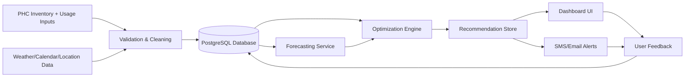

# SDD-HLD.md
# Software Design Document / High-Level Design

## 1. Purpose

This document defines **how the system works** from an architecture perspective.  
It explains the components, data flow, services, storage, optimization logic, and deployment design for the PHC Inventory Optimization System.

The design is based on a hybrid architecture: **forecasting + optimization + alerting**.  
This is the best fit for inventory redistribution systems because demand prediction alone is not enough; the system must also compute a feasible transfer plan. OR-Tools is a strong fit for the optimization layer because it supports linear programming, flow, and constraint-based optimization at scale.[web:53]

---

## 2. System Overview

Smart Health (PHC Intelligence) is a decision-support platform for PHCs that predicts item demand and computes stock redistribution plans across multiple PHCs in a block or district.

The system consists of:
- Data ingestion layer.
- Validation and preprocessing layer.
- Database layer.
- Forecasting service.
- Optimization engine.
- Notification service.
- Web dashboard.
- Feedback loop.

---

## 3. Architectural Goals

- Support low-resource PHC environments.
- Keep the system explainable.
- Allow batch-based daily updates.
- Produce actionable transfer recommendations.
- Work with synthetic or real inventory data.
- Keep deployment simple enough for a hackathon MVP.
- Scale later to district-level coordination.

---

## 4. High-Level Architecture

---

## 5. Core Components

## 5.1 Data ingestion layer
Responsible for receiving:
- CSV uploads.
- Manual form entries.
- API-based sync in future versions.

It must support:
- inventory snapshots,
- usage history,
- PHC master records,
- expiry data,
- optional external data.

## 5.2 Validation and preprocessing layer
This layer:
- checks missing values,
- standardizes item names,
- normalizes units,
- removes duplicates,
- validates expiry and stock values,
- creates model-ready features.

## 5.3 Database layer
Stores all raw and processed data.  
PostgreSQL is the best choice for MVP because it is stable, relational, and easy to query for PHC inventory workflows.

## 5.4 Forecasting service
Predicts near-future demand for each medicine/item at each PHC.

Best-fit design:
- baseline moving average,
- lag-feature machine learning,
- optional seasonal model,
- confidence scoring.

## 5.5 Optimization engine
Generates the transfer plan based on:
- forecast demand,
- current stock,
- expiry risk,
- transfer cost,
- safety stock,
- PHC distance.

Best-fit solver:
- Google OR-Tools is recommended because it supports linear optimization, flow algorithms, and constraint programming, which are well suited to redistribution problems.[web:53]

## 5.6 Recommendation store
Stores:
- transfer suggestions,
- alert status,
- confirmed actions,
- rejected actions,
- audit trail.

## 5.7 Notification service
Sends:
- shortage alerts,
- expiry alerts,
- transfer recommendations,
- confirmation reminders.

Channels:
- dashboard.
- email.
- SMS.
- optional mobile push.

## 5.8 Dashboard UI
Shows:
- current stock,
- forecasted risk,
- recommended transfers,
- action history,
- block-wide summaries.

## 5.9 Feedback loop
Uses confirmed transfer outcomes and real stock changes to refine future predictions and thresholds.

---

## 6. Data Flow

### Step 1
PHC staff enters inventory and usage data.

### Step 2
System validates and stores the data.

### Step 3
Forecasting model estimates demand per item per PHC.

### Step 4
Optimization engine compares forecasted demand with available stock.

### Step 5
The system generates transfer recommendations.

### Step 6
Alerts are shown and sent.

### Step 7
Users confirm, reject, or modify the transfer.

### Step 8
Actual outcome is stored for future learning.

---

## 7. Functional Modules

## 7.1 Inventory module
Handles:
- stock entry,
- batch tracking,
- expiry tracking,
- current balance display.

## 7.2 Forecast module
Handles:
- item demand prediction,
- confidence output,
- demand spike detection,
- seasonal adjustments.

## 7.3 Redistribution module
Handles:
- donor identification,
- receiver identification,
- quantity suggestion,
- transfer feasibility.

## 7.4 Alerting module
Handles:
- shortage warnings,
- expiry warnings,
- transfer notices,
- status confirmations.

## 7.5 Reporting module
Handles:
- waste avoided,
- shortages prevented,
- transfer summaries,
- PHC health score.

---

## 8. Best-fit Technology Decisions

## 8.1 Why forecasting + optimization
Recent inventory and drug-demand research shows that prediction and optimization are most effective when combined rather than used separately.[web:37][web:38][web:40][web:43][web:46]

## 8.2 Why OR-Tools
OR-Tools is suitable because it supports:
- linear optimization,
- integer constraints,
- graph-based allocation,
- flow problems,
- routing problems if needed later.[web:53]

## 8.3 Why PostgreSQL
It provides:
- relational integrity,
- transaction support,
- easy reporting,
- auditability,
- compatibility with analytics pipelines.

## 8.4 Why FastAPI
It is lightweight, fast to build, and ideal for ML-backed APIs.

## 8.5 Why Next.js
It provides fast dashboard development and good UI performance.

---

## 9. Design Patterns

## 9.1 Service-oriented modularity
Split backend into small services:
- ingestion,
- forecasting,
- optimization,
- alerting.

## 9.2 Batch-first processing
For MVP, use once-daily batch runs instead of real-time inference.

## 9.3 Explainable output pattern
Every recommendation must include:
- action,
- reason,
- confidence,
- expected benefit.

## 9.4 Audit-first workflow
Every transfer recommendation and confirmation should be logged.

---

## 10. Non-functional Requirements

### Performance
- Forecast and optimization should complete quickly enough for daily operational use.

### Reliability
- System should survive missing data and still produce fallback recommendations.

### Usability
- Dashboard must be simple enough for non-technical staff.

### Scalability
- Initially support a small block.
- Later scale to district-level coordination.

### Security
- Role-based access.
- No unnecessary sensitive data.
- Secure API endpoints.

### Maintainability
- Modular codebase.
- Config-driven medicine rules.
- Clear model versioning.

---

## 11. Deployment Design

### MVP deployment
- Frontend: hosted web app.
- Backend: FastAPI service.
- Database: PostgreSQL.
- ML worker: scheduled Python job.
- Alerts: email/SMS integration.

### Production-style evolution
- Containerize services with Docker.
- Deploy on Cloud Run or similar.
- Use scheduled jobs for daily forecasting.
- Add queue/pub-sub for alert generation.

---

## 12. Core Algorithms

## 12.1 Demand forecasting
Use:
- moving average baseline,
- lag features,
- XGBoost/LightGBM for stronger tabular prediction,
- Prophet as seasonal benchmark.

## 12.2 Stock risk scoring
A composite score using:
- predicted demand,
- current stock,
- days to expiry,
- recent usage trend.

## 12.3 Transfer optimization
Objective:
- minimize shortage,
- minimize expiry waste,
- minimize transport cost.

Constraints:
- donor safety stock,
- receiver capacity,
- transfer feasibility,
- distance threshold if needed.

## 12.4 Conflict resolution
If multiple receivers need the same donor stock:
- prioritize highest shortage risk,
- then earliest expiry,
- then lowest transport cost.

---

## 13. Interfaces

## 13.1 Internal API interfaces
- `/upload/inventory`
- `/upload/usage`
- `/forecast/{phc_id}`
- `/recommendations`
- `/confirm-transfer`
- `/dashboard-summary`

## 13.2 External integrations
- Weather API.
- Maps API for distance.
- SMS/email service.
- Future HMIS import.

---

## 14. Architecture Risks

- Data quality problems.
- Forecasting errors in sparse datasets.
- Unfeasible transfer recommendations if transport is limited.
- User mistrust if explanations are weak.
- Overengineering the MVP.

Mitigation:
- Start simple.
- Use strong fallback rules.
- Make every action explainable.
- Use synthetic data for initial proof.

---

## 15. MVP Architecture Decision

For the hackathon version:
- Use **batch processing**.
- Use **tabular forecasting** rather than deep learning.
- Use **OR-Tools** for optimization.
- Use **PostgreSQL** for storage.
- Use **FastAPI + Next.js** for implementation.

This gives the best balance of speed, quality, and feasibility.

---

## 16. Conclusion

The system is designed as a practical PHC inventory intelligence platform that combines forecasting, optimization, and human-in-the-loop approvals. The architecture is intentionally modular so the product can start small and later scale into a broader district-level health logistics platform.
