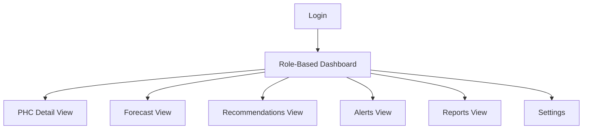
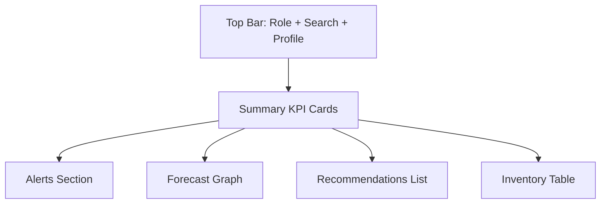
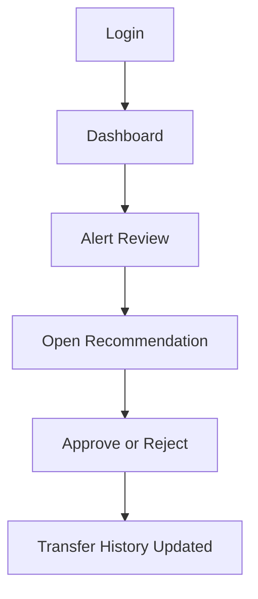

# UI-UX-Design-System.md
# UI/UX Design System

## 1. Purpose

This document defines the complete user interface and experience design for the PHC Inventory Optimization System.  
The goal is to make the product fast to understand, easy to use, and suitable for low-resource healthcare workflows.

Healthcare dashboards work best when they reduce cognitive load, support role-based views, and present the most important decisions first.[web:73][web:80][web:81]

---

## 2. UX Principles

1. **Decision-first design**  
   The screen should help users decide what to do next.

2. **Role-based simplicity**  
   Doctors, pharmacists, and managers should each see only what they need.

3. **Low-bandwidth friendliness**  
   Minimize heavy visuals and unnecessary motion.

4. **Explainable by default**  
   Show the reason behind every recommendation.

5. **One screen, one purpose**  
   Each page should have a clear task.

6. **Mobile-first layout**  
   Many users may access the system on phones.

7. **Error tolerance**  
   Help users recover from bad input or missing data.

---

## 3. Design Language

## 3.1 Visual tone
- Clean.
- Medical.
- Trustworthy.
- Calm.
- High contrast for readability.

## 3.2 Color system
- **Green**: healthy stock / safe status.
- **Amber**: warning / medium risk.
- **Red**: shortage / urgent action.
- **Blue**: neutral info.
- **Gray**: inactive / secondary.

## 3.3 Typography
- Use a modern sans-serif font.
- Large numbers for KPIs.
- Clear labels.
- Simple sentence case.

## 3.4 Layout style
- Card-based dashboard.
- Minimal sidebar.
- Clear top summary.
- Tables for detailed inventory.
- Charts only when they add decision value.

---

## 4. Role-Based Experience

## 4.1 PHC Pharmacist
Needs:
- current stock,
- expiry alerts,
- recommended transfers,
- quick confirmation.

Primary screen:
- Inventory Dashboard.

## 4.2 Medical Officer
Needs:
- shortage warnings,
- care impact summary,
- medicine availability forecast.

Primary screen:
- PHC Overview.

## 4.3 Block Health Manager
Needs:
- multiple PHC comparisons,
- shortage heatmap,
- transfer approvals,
- block-level summaries.

Primary screen:
- Block Control Center.

## 4.4 District Officer
Needs:
- district summary,
- top-risk PHCs,
- waste and shortage trends.

Primary screen:
- District Intelligence View.

---

## 5. Information Architecture

---

## 6. Core Screens

## 6.1 Login screen
### Purpose
Authenticate the user and route them to the correct role dashboard.

### Elements
- logo,
- role-based sign in,
- username/password,
- optional OTP later.

### Behavior
- redirects user after login,
- hides irrelevant sections by role.

---

## 7. Dashboard Screen

## 7.1 Purpose
Show the most important stock status and next actions immediately.

## 7.2 Main components
- top summary cards,
- shortage alerts,
- expiry alerts,
- recommendation card list,
- line chart for demand,
- transfer status panel.

## 7.3 Key metrics
- items at shortage risk,
- items near expiry,
- total safe stock value,
- recommended transfers,
- pending actions.

## 7.4 Design rule
The dashboard should answer:
- What is wrong?
- What should I do?
- Why is it happening?

---

## 8. PHC Detail Screen

## 8.1 Purpose
Show inventory health for one PHC and one item group.

## 8.2 Components
- PHC name and location,
- item-wise stock table,
- demand trend chart,
- expiry list,
- stockout risk score,
- action suggestions.

## 8.3 Interactions
- filter by medicine,
- sort by risk,
- open item details,
- confirm transfer suggestion.

---

## 9. Recommendations Screen

## 9.1 Purpose
Show all suggested stock transfers and priority actions.

## 9.2 Recommendation card contents
- source PHC,
- target PHC,
- medicine name,
- suggested quantity,
- urgency,
- reason text,
- approve / reject button.

## 9.3 Priority logic
The highest-risk and nearest-feasible recommendations should appear first.

## 9.4 User action
The user can:
- approve,
- reject,
- adjust quantity,
- defer for later review.

---

## 10. Alerts Screen

## 10.1 Purpose
Show urgent notifications and warnings.

## 10.2 Alert types
- shortage alert,
- expiry alert,
- transfer due,
- transfer overdue,
- data missing alert.

## 10.3 UI style
Use colored banners and badges, but avoid excessive alarm styling.

---

## 11. Reports Screen

## 11.1 Purpose
Show summary analytics for managers.

## 11.2 Reports
- stockout reduction trend,
- expiry waste avoided,
- transfer completion rate,
- top risky medicines,
- top risky PHCs.

## 11.3 Export options
- CSV download,
- PDF summary,
- print-friendly report.

---

## 12. Visual Components

## 12.1 Card types
- KPI cards,
- warning cards,
- transfer cards,
- status cards.

## 12.2 Chart types
- line chart for demand trend,
- bar chart for item comparison,
- stacked bar for stock vs demand,
- heatmap for block-level risk.

## 12.3 Table types
- inventory table,
- recommendation table,
- alert table,
- history table.

## 12.4 Modal types
- transfer confirmation,
- reject reason,
- edit quantity,
- upload file confirmation.

---

## 13. Interaction Patterns

## 13.1 Confirmation-first workflow
Every suggested transfer should require user confirmation.

## 13.2 Inline explanations
Each recommendation should have a short explanation underneath.

## 13.3 Drill-down behavior
Users should be able to move from summary to detail in one click.

## 13.4 Smart filtering
Users should be able to filter by:
- PHC,
- item,
- urgency,
- expiry window,
- status.

---

## 14. Mobile UX

The system must work well on mobile because many staff may use phones.

### Mobile rules
- stack cards vertically,
- use sticky action buttons,
- avoid dense tables,
- collapse advanced filters,
- keep font size readable.

### Mobile-first priority screens
- dashboard,
- alerts,
- recommendation approval.

---

## 15. Accessibility

- High contrast text.
- Clear icon labels.
- Large touch targets.
- Color should never be the only signal.
- Keyboard navigation support.
- Simple language, not technical jargon.

---

## 16. Dashboard Layout Proposal

---

## 17. Component Library

## 17.1 Reusable components
- `TopNav`
- `Sidebar`
- `MetricCard`
- `AlertBanner`
- `RecommendationCard`
- `StatusBadge`
- `TrendChart`
- `InventoryTable`
- `TransferModal`
- `ConfirmDialog`

## 17.2 Design consistency
All cards should use:
- same border radius,
- same shadow depth,
- same spacing scale,
- same badge style,
- same color semantics.

---

## 18. Content Guidelines

Use:
- short titles,
- simple language,
- action verbs,
- one recommendation per card.

Avoid:
- long paragraphs,
- technical model language,
- unnecessary jargon,
- unclear abbreviations.

Example good text:
> “Move 40 ORS packs from PHC-2 to PHC-5 before Friday.”

Example bad text:
> “Optimization objective indicates inventory rebalancing recommendation.”

---

## 19. User Flow Design

---

## 20. UI States

Each major screen should support:
- loading state,
- empty state,
- error state,
- success state,
- no-data state.

### Example empty state
“Nothing urgent today. Stock levels are healthy.”

### Example error state
“Forecast data unavailable for this PHC. Please upload stock data.”

---

## 21. Visual Hierarchy Rules

1. Alerts first.
2. Recommendations second.
3. Inventory health third.
4. Charts fourth.
5. History and logs last.

This is important because healthcare dashboards must support quick operational action, not just data exploration.[web:73][web:80][web:81]

---

## 22. UI for Hackathon Demo

For the hackathon version, keep the UI to:
- login screen,
- dashboard,
- PHC detail,
- recommendation page,
- alert page,
- report summary.

That is enough to show end-to-end value.

---

## 23. Final UX Direction

The UI should feel like a **control room for PHC stock planning**.  
It must be simple enough for field staff, clear enough for managers, and polished enough for judges. The main goal is to reduce effort while making the right action obvious.
